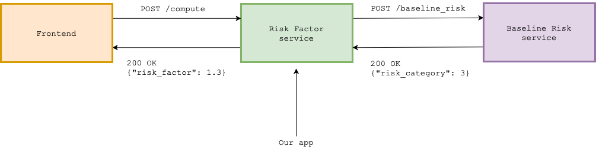

# COVID-19 Risk Factor Estimator 🦠

## Goals 🎯

You'll be working on a basic Flask application. As you'll discover, the app is not ready for production quite yet! The goals are:

1. Talk through the code and explain what it does at a high level.
2. Run the application, and make a request with `curl`.
3. Implement the `/compute` endpoint. With tests!

IMPORTANT!

_Don't worry if the endpoint is not completed by the end of the interview. Points of discussion during the interview will affect how much code ends up being written._

## Overview

The app estimates a "risk factor" (a positive floating point number >= 1.0) of an individual in England regarding COVID-19. The value computed will be used in downstream services.

To compute the risk factor:

```
risk_factor = baseline_risk * area_modifier
```

### Baseline Risk

The baseline risk is an individual's susceptibility, and is retrieved from a separate service, which is documented [here](https://dse-test-api.herokuapp.com).



The Baseline Risk service's performance is variable, and the underlying model will not be changing as the team responsible is migrating to a new service.

### Area modifier

The area modifier is computed in our app, and is based on the case rate of the region. There is a function provided (`case_rate_to_area_modifier`) which converts the case rate in `data.json` to a modifier.

## App overview

The API exposes two endpoints:

- `GET /areas` - returns a list of regions in England.
- `POST /compute` - given an individual's health characteristics and area, returns a risk factor with regards to COVID-19.

The available regions are returned by the `GET /areas` API:

```bash
curl http://localhost:5000/areas
```

```json
{
  "items": [
    {
      "code": "E12000006",
      "name": "East of England"
    },
    {
      "code": "E12000007",
      "name": "London"
    },
    {
      "code": "E12000003",
      "name": "Yorkshire and The Humber"
    }
    // etc
  ]
}
```

And a caller uses the `POST /compute` API to calculate the risk factor:

```bash
curl -X POST localhost:5000/compute --data '{"height": 180, "weight": 75, "underlying_health_issues": false, "age_group": "group_1", "area_code": "E12000007"}'
```

Due to the need to keep as much data anonymised as possible, we deal in `age_groups` rather than specific ages.

| Age range | Group id |
| --------- | -------- |
| < 18      | group_0  |
| (18, 30]  | group_1  |
| (30, 45]  | group_2  |
| (45, 65]  | group_3  |
| (65, 80]  | group_4  |
| > 80      | group_5  |

## Application structure 🔭

The app is written in Python using the Flask framework.

```
covid_app/
  core.py        ← module to compute the risk factor
  dataset.py     ← module to read the dataset from the filesystem
  validation.py  ← module to validate incoming requests

tests/           ← unit tests

app.py           ← API views
data.json        ← rate of new cases per region
requirements.txt ← Python dependencies
```

## Running the app

### Repl.it

We run the app in an online IDE, called [repl.it](https://replit.com/).

You can simply click the green _Run_ button to run the app and the output will be shown in the _Console_ tab.

You can run commands from the _Shell_ tab for example:

```bash
$ curl localhost:5000/
```

```bash
$ pytest tests
```

You have access to a key value store with a similar API to that of a Python dictionary:

```Python
from replit import db

db["key"] = "value"
```

### Locally

The app should run on Python3.7+. Feel free to set up as you feel comfortable, but for reference you can:

1. Create a virtualenv and install the requirements:

```bash
$ python3 -m venv .venv
$ . .venv/bin/activate
$ pip3 install -r requirements.txt
```

2. Run the app:

```bash
$ flask run
```

3. Run the tests:

```bash
$ pytest tests
```
